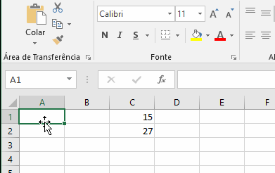
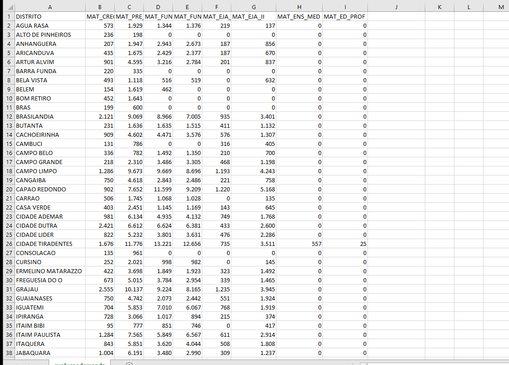
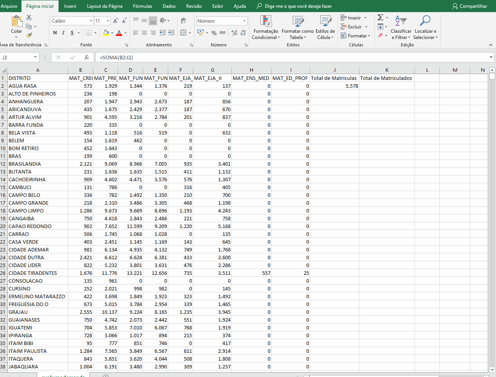
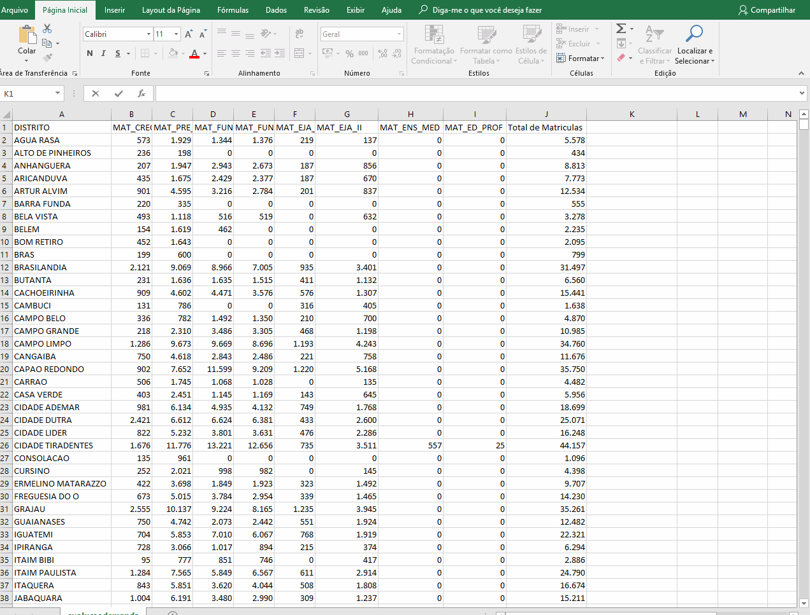

# Fórmulas

Agora que já temos nossos dados importados, começaremos a extração de  informações.

Lembre-se de que na [página](http://dados.prefeitura.sp.gov.br/dataset/perfil-dos-educandos-cor-raca-idade-sexo-necessidades-educacionais-especiais) em que fizemos o download do CSV "Perfil dos educandos - Cor/raça, idade, sexo, necessidades educacionais especiais", temos o arquivo "Dicionário", que será importante para a compreensão das siglas presentes no nosso CSV.

Tópicos a serem abordados:

* Introdução a funções

* Função SOMA

* Função SE

* Função SOMASE

## Introdução a funções

As funções no excel são uma das maneiras mais simples de automatizar processos, o que é muito útil, seja no tratamento de pequenos conjuntos de valores até tabelas bastante grandes.

## Introduzindo valores
Para introduzir um valor no excel, basta clicar na célula em questão e digitar o valor que quisermos. Aqui, usamos o termo valor de forma genérica: pode ser uma quantia em dinheiro, uma data, um nome. O excel é capaz de tratar todos esses tipos de dados. Vejamos como informar o que está na célula do excel mais à frente.

## Introduzindo funções
Para introduzir funções, fazemos de maneira similar aos valores: clicamos na célula que queremos alterar e digitamos o que desejamos inserir. Entretanto, para “informarmos” ao excel que queremos que aquilo seja avaliado como uma função em vez de um valor, basta colocarmos um símbolo de **=** no começo do que estamos digitando.

Uma vantagem de se escrever assim é que o excel imediatamente reconhece que estamos escrevendo uma fórmula e mostra uma série de opções assim que começamos a digitar o nome da função.

## Barra de Fórmulas

Além de escrever diretamente nas células, umas ferramenta muito prática é a barra de fórmulas. Nela, podemos escrever ou editar o conteúdo das células.

Para isso, basta selecionar a célula que queremos editar, clicando sobre ela e, então, digitar os valores ou fórmulas que desejamos inserir diretamente na barra de fórmulas.

Escrever sobre a célula ou na barra de fórmulas são equivalentes, tudo depende da ação que estejamos realizando.

## Fórmulas básicas

Podemos fazer operações básicas no excel usando os operadores conhecidos da matemática: +, -, * e /.
No excel, fazemos referência às células pela letra de sua coluna, seguida do número de sua linha.
Assim, podemos selecionar uma célula para guardar o resultado da operação entre outras células.

1. Para somar, escolha uma célula que guardará o resultado e digite =C1+C2, por exemplo, em seguida, pressione ENTER.
2. Para somar, escolha uma célula que guardará o resultado e digite =C1-C2, por exemplo, em seguida, pressione ENTER.
3. Para somar, escolha uma célula que guardará o resultado e digite =C1*C2, por exemplo, em seguida, pressione ENTER.
4. Para somar, escolha uma célula que guardará o resultado e digite =C1/C2, por exemplo, em seguida, pressione ENTER.

## Algumas funções úteis

### Função SOMA
Esta é uma das funções mais básicas e úteis do excel.

Utilizaremos esta [base de dados](http://dados.prefeitura.sp.gov.br/dataset/demanda-por-vagas-educacao-infantil-e-eja) para calcular o número de matriculados por distrito. 

* Primeiro, adicionamos um cabeçalho, indicando que aquela coluna faz referência ao total de matrículas.

* Em seguida, digitamos =SOMA e selecionamos a função SOMA que o excel sugere, com o mouse.

* Selecionamos as colunas B até I, referentes ao distrito de AGUA RASA.

* Agora, na célula J2, temos o total de matrículas em AGUA RASA.

E se quisermos repetir esta mesma operação para todos os outros 95 distritos?

### Definindo um nome
Queremos agora aplicar a mesma fórmula de SOMA que utilizamos para AGUA RASA aos outros distritos. Poderíamos reescrever em cada um, mas isso não seria muito eficiente. 

Utilizaremos a definição de nomes e a função preencher para facilitar essa tarefa.

Queremos selecionar todas as linhas da coluna J, com exceção da primeira, nosso cabeçalho.

* Selecionamos a célula J2.

* Em fórmulas, clicamos em "Definir nome".

* Na nova janela, digitamos o nome "Matrículas".

* Em "refere-se a:", incluímos ao final "::$J$97", tendo como resultado final: 

	=evolucaodemanda!$J$2:$J$97

Isso indica que estamos associando o nome "matrículas" às células J2 até J97.

### Preencher
Agora, aplicaremos a mesma fórmula SOMA para todos os distritos.

* Primeiro,clicamos na *CAIXA DE NOME* no canto superior esquerdo e selecionamos o nome que acabamos de definir, Matrículas.

* Agora, selecionamos o símbolo referente ao comando preencher.

* Na caixa que se abriu, selecionamos "para baixo".

Pronto! Nossa fórmula de soma acabou de ser aplicada para todos os distritos!

### Total das Somas
Finalmente, calcularemos a soma total de todos os matriculados em todos os distritos. Com o nome "matrículas" que definimos anteriormente, isso fica bastante simples:

* Criaremos um novo cabeçalho chamado "Total geral".

* Selecionamos a célula K2 e inserimos a fórmula de soma:

	=SOMA

* Como argumento, digitamos o nome que definimos: "matrículas" e teclamos enter. 

* A célula K2 mostra a soma de todas as células da coluna J, com exceção do cabeçalho, conforme definimos pelo nome "matrículas".

### FUNÇÃO SE

A função SE permite que criemos uma condição para que alguma tarefa seja realizada.

Com o COUNT.SE fomos capazes de contar quantas vezes ocorreu um certo valor nos nossos dados. Mas, e se quisermos, além de ver a ocorrência de grupos femininos e masculinos, saber a quantidade total de alunos de cada sexo, multiplicando pela coluna QTD?

Vamos usar a função **SE**.

* Escolha uma célula de destino e digite =SE e clique sobre a função duas vezes.

A função SE recebe três argumentos:

	=SE(Teste lógico, valor verdadeiro, valor falso)	

Então, podemos escrever a função como:

	=SE(CELULASEXO = "F", QTD, 0)

Dessa forma, se a célula em questão for igual a F, recuperamos o valor QTD associado. Caso contrário, não a contamos.

### FUNÇÃO SOMASE

Mas a função SE ainda não é suficiente para descobrirmos o valor total de alunos de cada sexo. Utilizando a função SOMASE, finalmente conseguiremos este resultado.

A função SOMASE recebe três argumentos:

	=SOMASE(intervalo, critérios, intervalo_soma)

O argumento intervalo é o intervalo a ser avaliado, de acordo com o critério no segundo argumento.
O argumento intervalo_soma é opcional: se o próprio intervalo a ser somado é o mesmo sendo avaliado, deixamos esse argumento em branco. Se não, colocamos o intervalo correspondente a ser somado.

* Escolha uma célula e digite a função =SOMASE, clicando duas vezes sobre seu nome.

* Escolha a coluna P em sua totalidade. Esse é nosso intervalo a ser avaliado.

* Na barra de fórmulas, digite: ;"F”. Esse é o nosso critério de soma.

* Finalmente, digite mais um ponto e vírgula e selecione a coluna T, para selecionar as quantidades. Esse é nosso intervalo de soma.

* Adicione um fecha parênteses e clique enter para visualizar o valor encontrado.

* Faremos o mesmo para obter o número de meninos, apenas trocando o "F" por "M".

