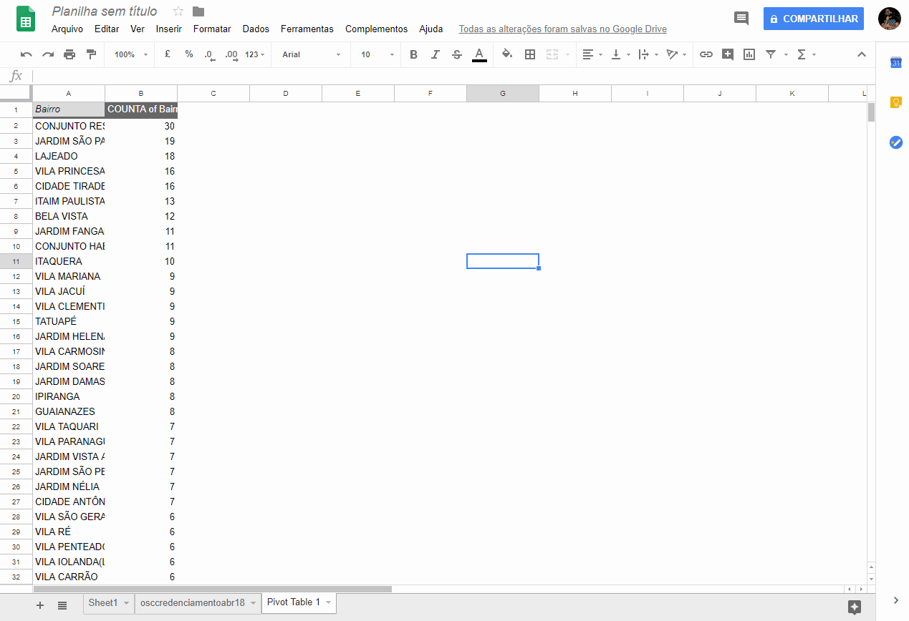
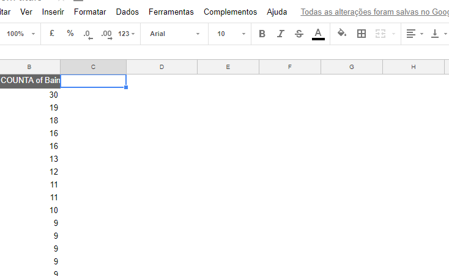
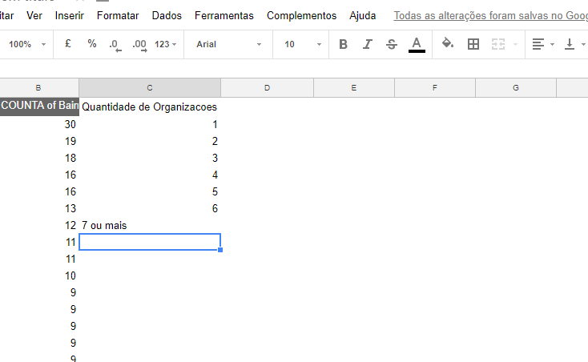

# Alternativas ao Excel

Tópicos a serem abordados

* Google Sheets

* Importando .csv

* Usando funções no Google Sheets

* Criando uma tabela dinâmica no Google Sheets

* Criando um gráfico a partir dos dados

* Função FREQUÊNCIA

## Google Sheets

O Google Sheets e uma ferramenta muito poderosa e, o melhor de tudo, grátis!

Ela pode ser acessada pelo navegador, editada por múltiplos usuários e os seus arquivos ficam salvos na nuvem e podem ser acessados por qualquer computador, através da sua conta do google.

### Acessando o Google Sheets

* Acesse [o site do google sheets](https://www.google.com/sheets/about/), logue com sua conta do google.

* Crie uma nova planilha em branco

### Importando .csv

* Faca o download do arquivo ["Instituições Credenciadas - Abr/2018"](http://dados.prefeitura.sp.gov.br/dataset/organizacoes-credenciadas-para-atendimento-da-educacao-infantil)

* Clique em Arquivo > Importar > Upload 

* Arraste o arquivo osccredenciamentoabr18.csv da pasta de downloads para a janela do Google sheets

* Aguarda a realização do upload

* Selecione **Inserir novas páginas**

* Selecione **Personalizado** e insira um ponto e vírgula ; na caixa

* Clique em **Importar dados**

* Aguarde a finalização da importação e clique em **"Abrir agora"**, caso sua planilha não aparece automaticamente.

### Usando funções no Google Sheets

Agora que temos nossos dados importados no Google Sheets, podemos começar a operar sobre eles.

Vamos analisar quais são os bairros com organizações credenciadas e quantas elas são.

#### Criando uma tabela dinâmica no Google Sheets

* Na aba superior, clique em Dados > Tabela Dinâmica

* No Menu da direita, na seção "Linhas", clique em ADICIONAR e no menu, escolha Bairro

* Na seção "Valores", clique em ADICIONAR e selecione Bairro

* Na seção "FILTROS", clique em ADICIONAR, selecione "Status Credenciamento"

* Clique em "Mostrando todos os itens" e desselecione "DESCREDENCIADA" e clique em OK

* De volta na seção "Linhas", em Ordem, selecione Decrescente

* Em classificar por, selecione COUNTA de Bairro

* Feche o menu da direita, clicando no "X"

O que obtivemos e uma nova tabela, em que os bairros aparecem em ordem alfabética e, ao lado, temos quantas organizações credenciadas estão presentes em cada um deles.

### Criando um gráfico a partir dos dados

Vamos criar um gráfico, mostrando quais bairros tem, pelo menos, 10 organizações ou mais cadastradas.

* Clique sobre a célula 1A e, sem soltar o clique, arraste até a célula B11, contendo o 10 referente a ITAQUERA

* Clique em Inserir > Gráfico

* Em "Tipo de gráfico", selecione Gráfico de colunas

* Clique na caixa "Alternar linhas/colunas"

* Assim, obtivemos um gráfico com os bairros que tem mais de 10 organizações cadastradas e os suas quantidades correspondentes

### Verificando distribuição de organizações por bairros

E se quiséssemos saber quantos bairros tem 1 instituição cadastrada, quantos tem 2 e assim por diante?

Primeiro vamos calcular as frequências:

* Vamos criar uma coluna "Quantidade de organizações"

* Vamos preencher suas linhas com valores de 1 até 6

* Na linha de número 8 vamos escrever 7 ou mais

Repare que o texto "7 ou mais" ficou alinhado a esquerda, vamos arrumar isso:

* Clique sobre a célula **C8**

* Clique na opção Formatar > Alinhar > Direita

Pronto, agora todos os valores estão alinhados!

Agora vamos criar a coluna "Quantidade de bairros", na coluna D. Nessa coluna, vamos colocar quantos bairros tem exatamente a quantidade de organizações listadas na esquerda. Para isso, iremos usar a função **FREQUÊNCIA**.

#### FREQUÊNCIA

A função frequência recebe dois argumentos, um vetor com dados e os intervalos que iremos separar esses dados.

	=FREQÜÊNCIA(matriz_dados; matriz_bin)
	=FREQÜÊNCIA(dados; intervalos)

Nós já temos esses dois argumentos! A matriz_dados e nossa coluna B e os intervalos são nossa coluna C, que criamos anteriormente!

* Clique sobre a célula D2 e digite =Frequency e selecione a função frequency

* Selecione a coluna B em sua totalidade, clicando sobre o B. Esse é nosso vetor de dados

* Digite um ponto e vírgula, indicando fim do primeiro argumento

* Selecione agora os números de 1 a 6 na Coluna C. Esses são os nossos intervalos.

* Não selecionamos o 7 ou mais. Automaticamente, a função frequência vai colocar os valores acima do nosso intervalo na célula seguinte.

### Plotando um novo gráfico

Vamos agora criar um novo gráfico, a partir das novas informações que coletamos.

* Selecione as células de D2 e D8 (D2:D8)

* Clique em Inserir > Gráfico

* Selecione "Gráfico de "

* Clique em marcador e escolha as células C2 e C8 (C2:C8)

Pronto! Agora temos um gráfico que mostra a distribuição do número de organizações cadastradas por bairro: Quantos bairros tem 1 organização cadastrada, quantos tem 2 e assim por diante.

