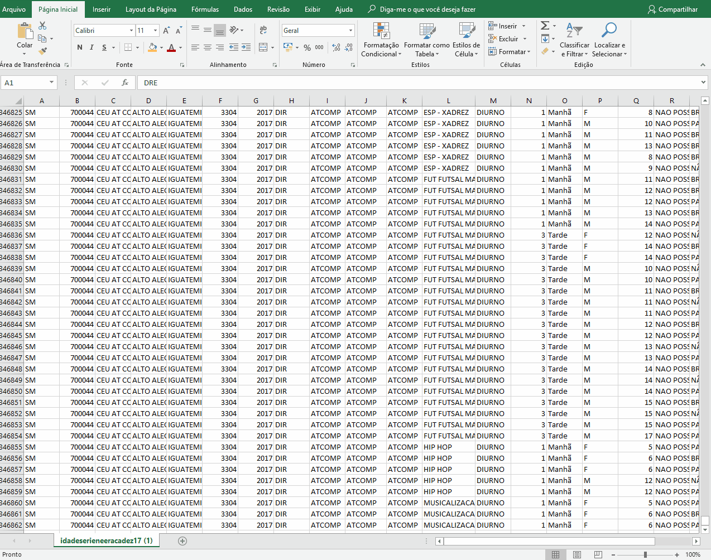
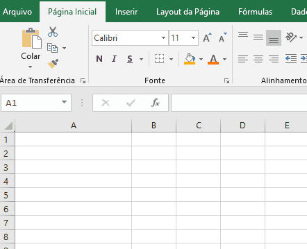

# Formulas

Agora que já temos nossos dados importados, vamos comecar a extrair informacoes deles.

Lembre-se que na [pagina](http://dados.prefeitura.sp.gov.br/dataset/perfil-dos-educandos-cor-raca-idade-sexo-necessidades-educacionais-especiais) que fizemos o download do CSV, temos o arquivo "Dicionario" que sera importante para "traduzirmos" as siglas presentes no nosso CSV.

## Introducao a funcoes

As funcoes no excel são uma das maneiras mais simples de automatizarmos processos, o que e muito útil, desde quando estamos tratando pequenos conjuntos de valores ate tabelas bastante grandes.

## Introduzindo valores
Para introduzir um valor no excel, basta clicar na celula em questão e digitar o valor que quisermos. Aqui, usamos o termo valor de forma generica: Pode ser uma quantia em dinheiro, uma data, um nome. O excel e capaz de tratar todos estes tipos de dados. Vamos ver como informar o questa não celula ao excel mais a frente.

## Introduzindo funcoes
Para introduzir funcoes, fazemos de maneira similar aos valores: clicamos na celula que queremos alterar e digitamos o que desejamos inserir. Entretanto, para avisarmos ao excel que queremos que aquilo seja avaliado como uma funcao ao invés de um valor, basta colocarmos um simbolo de **=** no comeco do que estamos digitando.

Uma vantagem de escrever assim, o excel imediatamente reconhece que estamos escrevendo uma formula e mostra uma serie de opcoes assim que comecamos a escrever o nome da funcao.

## Barra de Formulas

Alem de escrever diretamente nas celulas, umas ferramente muito pratica e a barra de formulas. Nela, podemos escrever ou editar o conteudo das celulas.

Para isso, basta selecionar a celula que queremos editar, clicando sobre ela e, então, digitar os valores ou formulas que desejamos inserir diretamente na barra de formulas.

Escrever sobre a celula ou na barra de formula são equivalentes, tudo depende da acao que estamos realizando.

## Algumas funcoes uteis

Vamos agora comecar algumas analises simples dos dados que importamos, utilizando algumas funcoes do excel

### Funcao CONT.SE
A funcao CONT.SE e bastante útil e pode nos informar o numero de celulas que atendem a algum criterio. Vamos supor como exemplo que desejamos contar quantos alunos são do sexo masculino e quantos são do sexo feminino. Temos um numero enorme de dados, mas essa analise fica muito simples com a funcao CONT.SE

Primeiramente, vamos criar uma nova planilha, para organizarmos nossas analises. Vamos clicar no botão +, localizado na parte inferior da nossa tela.

Uma nova aba vai se abrir. Podemos clicar duas vezes sobre ela para renomea-la. Vamos chama-la de analises.

Agora nessa nova planilha, vamos usar a funcao CONT.SE para verificar a distribuicao de alunos do sexo masculino e feminino.

* Selecionamos uma celula e digitamos o simbolo de =
* Digitamos CONT.SE. Perceba que o excel comeca a mostrar opcoes conforme você digita, não sendo necessário digitar o comando inteiro.
* Clique duas vezes sobre o nome CONT.SE para inserir a formula na celula.

Conforme aparece na tela, o comando CONT.SE leva dois argumentos:

	=CONT.SE(intervalo; criterios)
	=CONT.SE(Onde você quer procurar?; O que você quer procurar?)
 
Queremos procurar quantos alunos do sexo feminino estão presentes na coluna P da planilha "idadeserieneeracadez17". Então vamos entrar esses dois argumentos na nossa formula.

Depois de inserir a CONT.SE na celula, vamos agora selecionar os argumentos.

Primeiro vamos selecionar as celulas que nos interessam. Neste caso, as informacoes sobre o sexo dos estudantes estão na coluna P. Queremos selecionar a coluna P em sua totalidade. 

* Vamos clicar na planilha "idadeserieneeracadez17" e clicar sobre o "P" que marca o nome da coluna.

Automaticamente, a formula que estamos criando, que esta escrita na barra de formula já foi preenchida com o argumento "idadeserieneeracadez17!P:P" que indica que vamos analisar a coluna P da planilha "idadeserieneeracadez17" em sua totalidade.

Agora precisamos preencher o segundo argumento da funcao, que nesse caso e o que queremos contar. 

* Clicamos na barra de formulas e adicionamos um ponto e virgula - ;

O ; indica que vamos agora inserir o próximo argumento. Neste caso, queremos contar o numero de meninas.

* Inserimos "F", a letra F entre aspas, assim o excel ira contar todas as ocorrências da letra F na coluna P.

* Colocamos entao um fecha parenteses - ) - no fim da formula e damos enter.

Agora, na nossa planilha "Analises", temos na celula escolhida um valor, 175986, que representa o numero de estudantes do sexo Feminino.

Assim, conseguimos obter esse valor de forma muito pratica, mesmo o conjunto de dados contendo mais de 300 mil estudantes.

