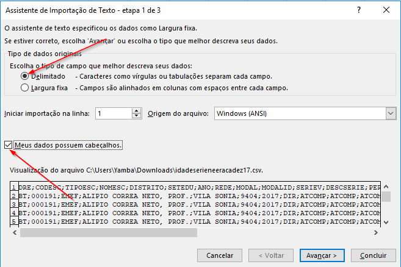
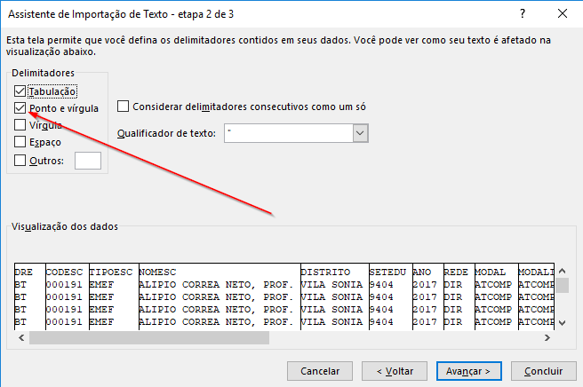
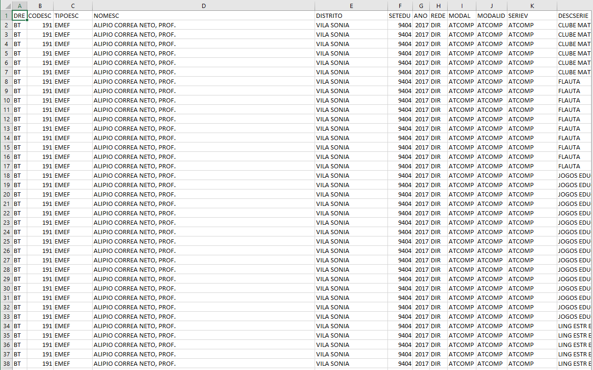

# Introducao ao Excel

Topicos a serem cobertos

* O que e uma planilha?
    Morfologia basica
    
* Backstage Button

* Barra de acesso rapido

* Importando conjunto de dados

* Name Box

* Formula Bar

* Formulas e funcoes - Soma, subtracoes e potenciacoes

* Graficos simples

* Salvamento e compartilhamento

* Algumas alternativas ao Excel

## O que e uma planilha? 

A planilha ou ingles spreadsheet e uma aplicacao de software que tem como finalidade salvar e organizar dados em linhas e colunas.

Usaremos a versao 2016 do Excel neste tutorial mas tudo deve ser equivalente para outras versoes.

Alguns dos elementos presentes na tela inicial do Excel sao:

1. Cedulas
2. Linhas - indicadas por numeros
3. Colunas - inidcadas por letras
4. Barra de formulas
5. Faixa de opcoes 
6. Nome da planilha atual

## Importando conjuntos de dados

### Baixando os dados
Vamos comecar importando um conjunto de dados para nosso trabalho.

Primeiramente, acesse [a pagina de dados abertos da prefeitura](http://dados.prefeitura.sp.gov.br/organization/educacao1). Nela existem diversos bancos de dados abertos. 

Para o nosso tutorial iremos usar o conjunto de dados [Perfil dos educandos ](http://dados.prefeitura.sp.gov.br/dataset/perfil-dos-educandos-cor-raca-idade-sexo-necessidades-educacionais-especiais)

Nesta pagina encontramos tres arquivos: Dicionario, que consta uma explicacao das siglas, e dois arquivos .csv - um extraido em 2017 e um 2016.

Clique em explorar e selecione a opcao Baixar

Voce pode reparar que existem dois tipos de arquivo, o de extensao .CSV e o .XLSX

Os arquivos .CSV sao arquivos de "valores separados por virgulas". Sao dados em tabelas que foram salvos como arquivos de texto.

Ja os arquivos .XLSX ou .XLS sao arquivos nativos do Excel.

Nao vamos entrar em mais detalhes por enquanto, o importante e que conseguimos editar ambos os tipos de arquivo com o Excel.

## Abrindo o arquivo

### Opcao 1 - importar

Se voce ja tem uma planilha em que esta trabalhnado e deseja importar esse novo conjunto de dados

* Clique na aba "Dados"
* selecione a opcao "Obter dados externos"
* escolha " de texto"

Escolha o arquivo que deseja importar, no nosso caso, idadeserieneeracadez17.csv, que fizemos o download na sessao anterior

Aparecerao 3 telas do assitente de importacao

1. Selecione "delimitado" e "Meus dados possuem cabecalhos". Clique "Avancar >"

2. Selecione "Ponto e virgula". Clique "Avancar >"

3. Finalmente, apenas clique "Concluir"

4. Na tela "Importar dados" voce pode selecionar colocar os dados na planilha existente ou em uma nova planilha. Neste momento, vamos selecionar a planilha existente.

Depois de finalizado este processo, sua planilha deve parecer com algo similar a isto:

